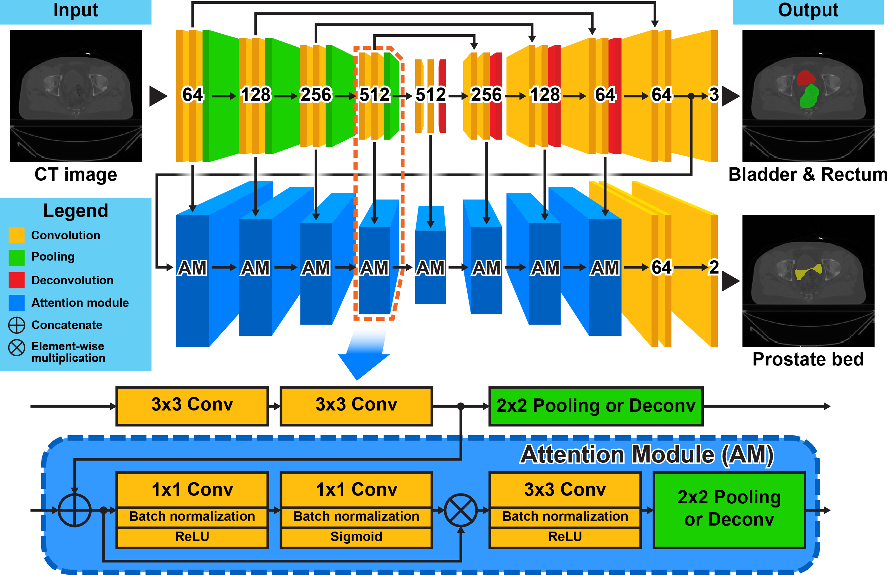
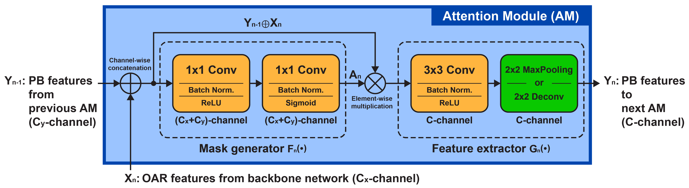

# AMTA-U-Net
This is a python (PyTorch) implementation of **Asymmetrical Multi-Task Attention U-Net** proposed in our paper [**Asymmetrical Multi-Task Attention U-Net for the Segmentation of Prostate Bed in CT Image**] published in **MICCAI 2020**. A journal paper as the extension of this work is currently under reviewing.

### Network architecture

### Inner structure of attention module

## Citation

Please cite our paper if it is useful for your research:

    @inproceedings{xu2020amtanet, 
      title = {Asymmetrical Multi-Task Attention U-Net for the Segmentation of Prostate Bed in CT Image},
      author = {Xu, Xuanang and Lian, Chunfeng and Wang, Shuai and Wang, Andrew and Royce, Trevor and Chen, Ronald and Lian, Jun and Shen, Dinggang},
      booktitle={International Conference on Medical Image Computing and Computer-Assisted Intervention},
      year = {2020},
      pages = {470--479},
      organization={Springer}
    }